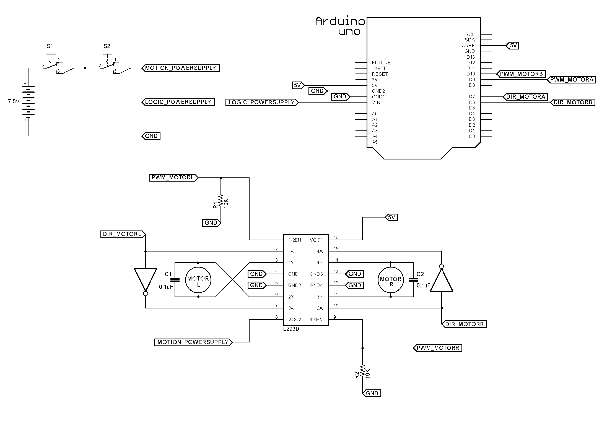
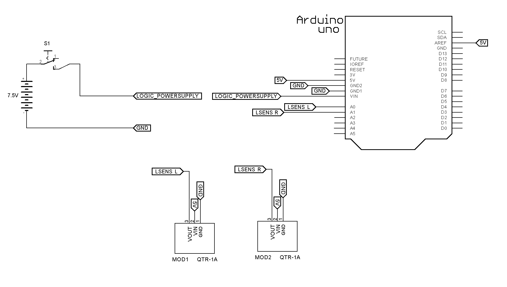
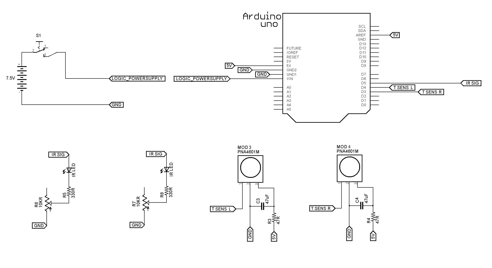
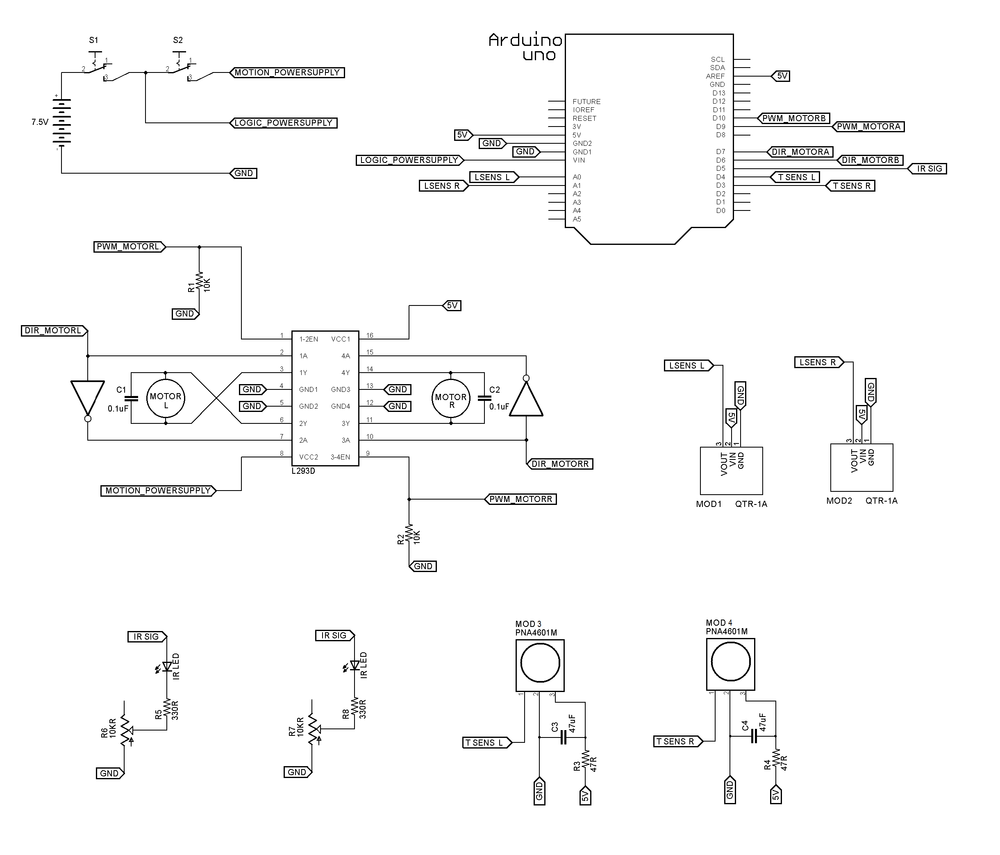
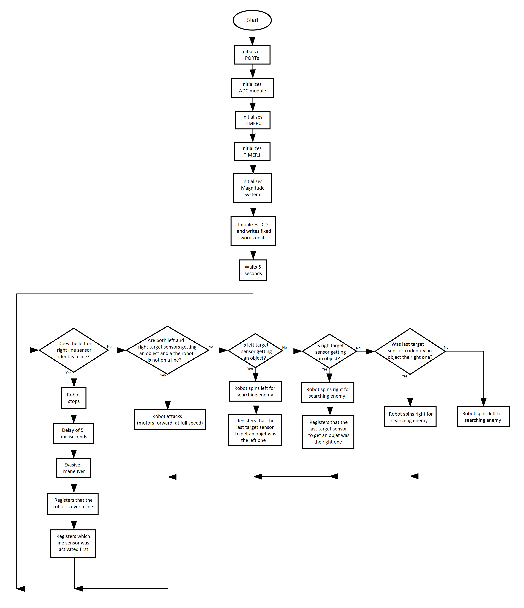

# MSOE | EE2930 Interfacing Systems Labs

## About the Project

This repository brings up an introductory series of implementations on how to design Embedded Systems in a more complex scale of implementation. The concepts covered in this series help you to understand the general working of modern microcontrollers, including many of their common peripherals.

The series presented here is a throwback of a course called EE2930 Interfacing Systems, taken by me as international student back in the Winter of 2014 at Milwaukee School of Engineering (MSOE). For this course, the microcontroller used was the ATmega328P, famous to compose Arduino boards such as Arduino Uno and Arduino Nano. However the general concepts covered touch a lot of concepts that are common sense for lots of modern microcontrollers, so the knowledge obtained from this course can be easily used to better understand the internal architecture other devices and build firmware for them. 

## Table of Contents

The series requirements and content is shown in detail by the section for each lab. The following content topics present each lab's title to present to you a general idea of what it approached in this serie: 

* [Lab 01: Power Supply and Processing Unit](#lab-01-power-supply-and-processing-unit)
* [Lab 02: DC Motors Integration](#lab-02-dc-motors-integration)
* [Lab 03: Line Sensors Integration](#lab-03-line-sensors-integration)
* [Lab 04: Target Sensors Integration](#lab-04-target-sensors-integration)
* [Lab 05: Full Integration](#lab-05-full-integration)

## Lab 01: Power Supply and Processing Unit

##### Requirements:

##### Built with:

##### Schematic:

##### Flowchart:

## Lab 02: DC Motors Integration

##### Requirements:

##### Built with:

##### Schematic:

##### Flowchart:

## Lab 03: Line Sensors Integration

##### Requirements:

##### Built with:

##### Schematic:

##### Flowchart:

## Lab 04: Target Sensors Integration

##### Requirements:

##### Built with:

##### Schematic:

##### Flowchart:

## Lab 05: Full Integration

##### Requirements:

##### Built with:

##### Schematic:

##### Flowchart:

