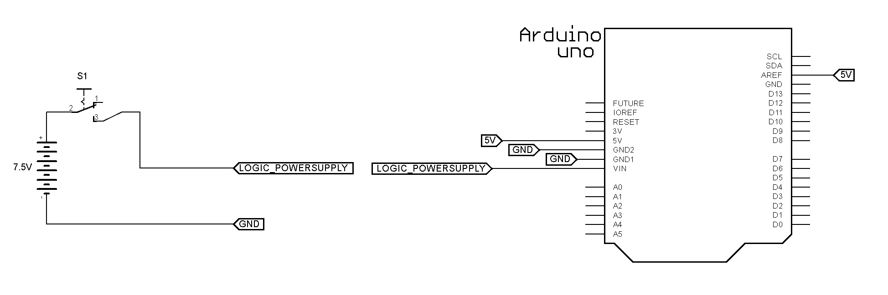
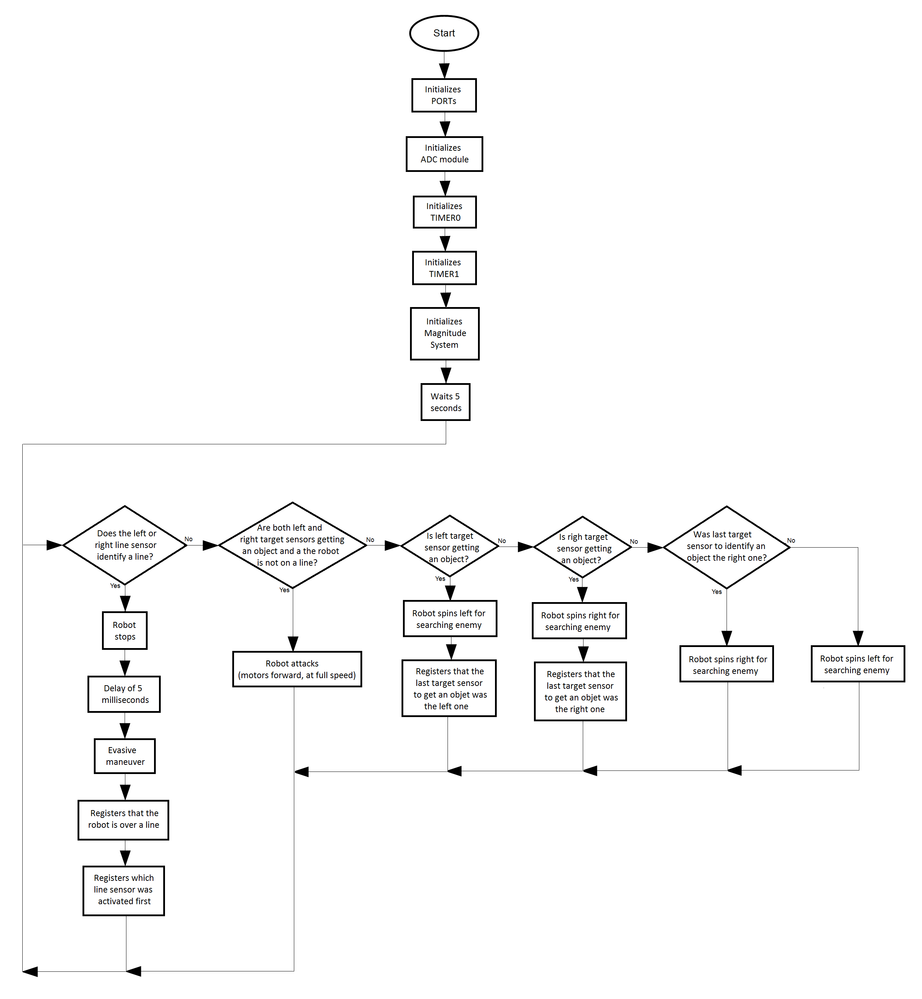

# MSOE | EE2930 Interfacing Systems Labs

## About this Repository

This repository brings up an introductory series of implementations on how to design Embedded Systems in a more complex scale of implementation. The concepts covered in this series help you to understand the general working of modern microcontrollers, including many of their common peripherals.

The series presented here is a throwback of a course called EE2930 Interfacing Systems, taken by me as international student back in the Winter of 2014 at Milwaukee School of Engineering (MSOE). For this course, the microcontroller used was the ATmega328P, famous to compose Arduino boards such as Arduino Uno and Arduino Nano. However the general concepts covered touch a lot of concepts that are common sense for lots of modern microcontrollers, so the knowledge obtained from this course can be easily used to better understand the internal architecture other devices and build firmware for them. 

## Table of Contents

The series requirements and content is shown in detail by the section for each lab. The following content topics present each lab's title to present to you a general idea of what it approached in this serie: 

* [Lab 01: Power Supply and Processing Unit](#lab-01-power-supply-and-processing-unit)
* [Lab 02: DC Motors Integration](#lab-02-dc-motors-integration)
* [Lab 03: Line Sensors Integration](#lab-03-line-sensors-integration)
* [Lab 04: Target Sensors Integration](#lab-04-target-sensors-integration)
* [Lab 05: Full Integration](#lab-05-full-integration)

## Lab 01: Power Supply and Processing Unit

##### Requirements:

This lab focuses on the initial wiring required for creating the sumobot intended for the course. The idea is to show basic connections between the battery pack used and the Arduino Uno so that it can be a platform for testing every feature designed as requirements in the next labs.

##### Built with:

* Arduino UNO
* 7.5 volts battery pack
* 3-contact switch

##### Schematic:

##### Flowchart:

## Lab 02: DC Motors Integration

##### Requirements:

This lab intends to show how could be made the wiring needed to interface the motors that are going to spin the sumobot wheels. For that implementation, the IC L293D is used to set up an H-bridge necessary for the Arduino Uno to control activation magnitude and direction for each one of the wheels.

##### Built with:

* Arduino UNO
* 7.5 volts battery pack
* L293D IC
* IC with 2 inverters 
* 2x 3-contact switches
* 2x DC motors

##### Schematic:

##### Flowchart:

## Lab 03: Line Sensors Integration

##### Requirements:

This lab covers the integration (including components wiring and firmware testing) for the line sensors. For the function of a sumobot, it's interesting to have a resource to identify white lines on the floor, which can be the the limits of the fight ring. This series use a couple of QTR-1A modules to do that function by getting intensity of IR light reflection towards the floor by using AD conversion. This functionality is tested separately in this lab.

##### Built with:

* Arduino UNO
* 7.5 volts battery pack
* 3-contact switch
* 2x QTR-1A modules

##### Schematic:

##### Flowchart:

## Lab 04: Target Sensors Integration

##### Requirements:

This lab covers the integration (including components wiring and firmware testing) for the target sensors assembly. For the function of a sumobot, it's interesting to have a resource to identify objects in front of the robot, which can be the fight opponents. This series use a couple of IR LED and PNA4601M pairs. Those pairs are going to have the function of getting the intensity of the IR LED's a reflection using PNA4601M towards the sumobot front. It allows to having a signal that corresponds to a presence or absense of objects in front of those assempblies mounted in the front of the robot. This functionality is tested separately in this lab.

##### Built with:

* Arduino UNO
* 7.5 volts battery pack
* 3-contact switch
* 2x PNA4601M components
* 2x IR LED's

##### Schematic:

##### Flowchart:

## Lab 05: Full Integration

##### Requirements:

This lab presents the full integration of all parts of the the sumobot created in this course. It refers to a general test of connections of and code of all components previously tested at the same time. It also presents the logics used by the robot to define a strategy to the fights using sensor resources provided (line and target sensors) to summarize information about the scenario and opponents in the environment as well as the control of directions and activations for the wheels, which is going to make possible to the robot to charge agains the opponents in the fighting ring.  

##### Built with:

* Arduino UNO
* 7.5 volts battery pack
* L293D IC
* IC with 2 inverters 
* 2x 3-contact switches
* 2x DC motors
* 2x QTR-1A modules
* 2x PNA4601M components
* 2x IR LED's

##### Schematic:

##### Flowchart:

